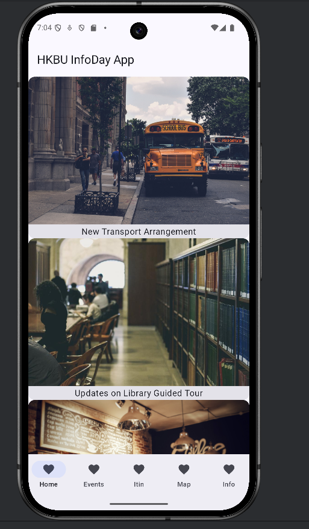
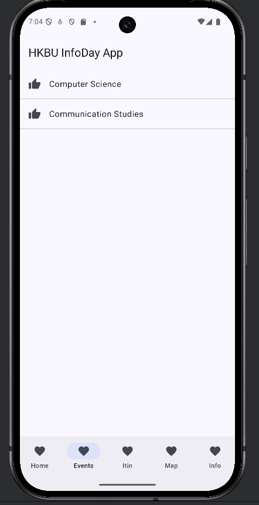
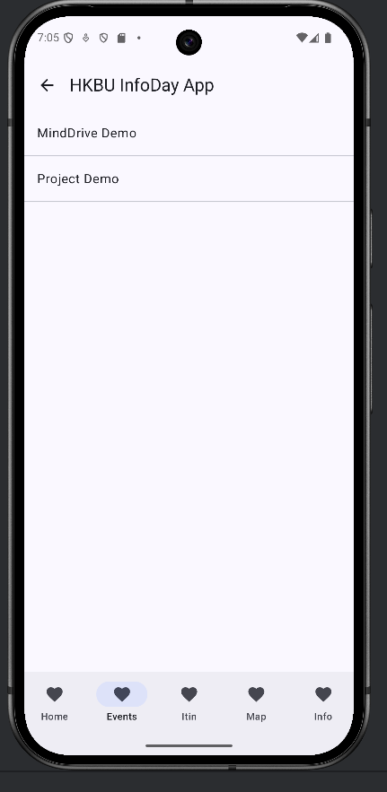
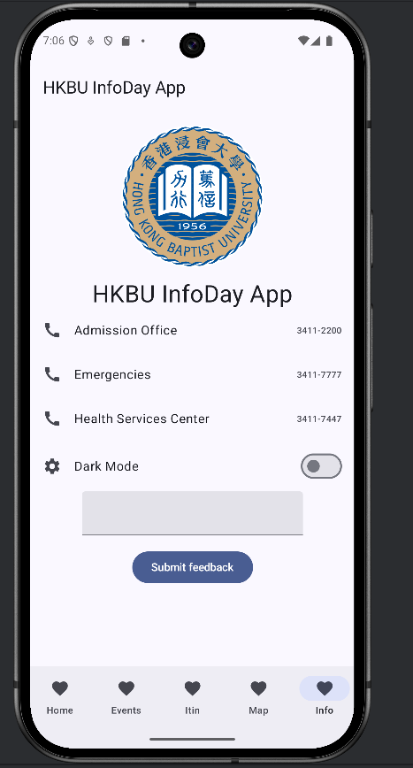
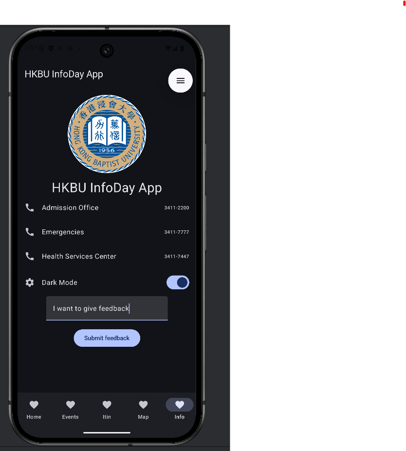
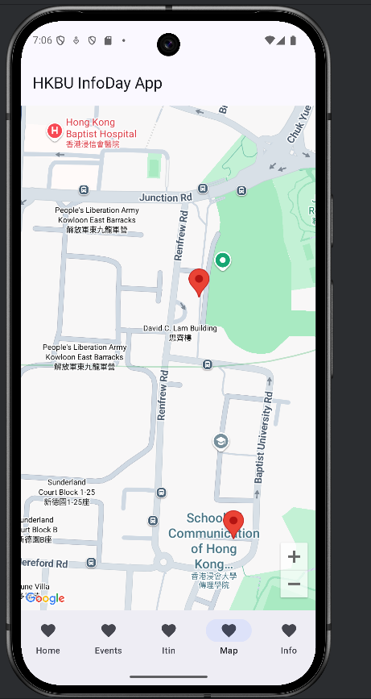
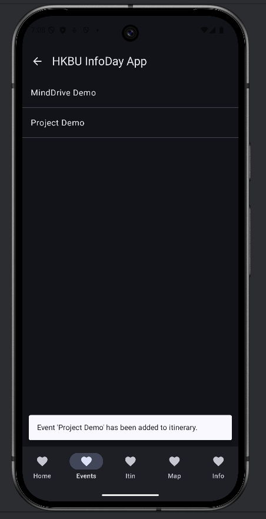
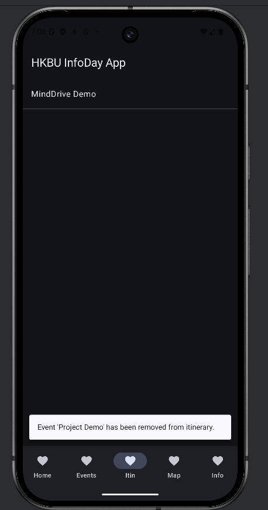

# HKBU Info Day App

## Setup Instruction

**Open Android Studio, Enable Version Control, Clone using the web URL:**  
[https://github.com/leoncheung610/Info-Day-App.git](https://github.com/leoncheung610/Info-Day-App.git)

---

## Features

### 1. Home Page: Fetch Information Using Ktor HTTP Requests

---

### 2. Event Screen
Find events by department

---

### 3. Save Dark Mode setting with DataStoreInstance & Give Feedback with Ktor

---

### 4. Map Function
Provides markers for selected buildings.

---
### 5. Add and Remove Events from Itinerary by Long Press (Saved to Room Database)

---

